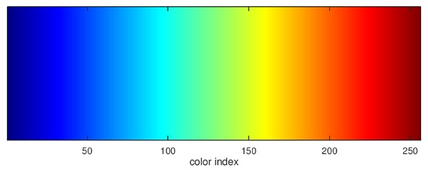

# Probability Simulator

## Installation
1. Download the source code [here](https://github.com/tman540/probability-simulator)
2. cd into the directory
3. run `pip3 install -r requirements.txt`
4. run `python main.py`

## Important notes:
#### Heatmap:
* The heatmap uses the `jet` color mapping.
* The jet color mapping goes as follows:

* Red is where there are the most values
* Green is medium
* Blue is where the least are

When the dartboard simulation is run, if there are sufficient values, the pattern should be shaped like a square dartboard, red by the bullseye, green arround it, and blue near the outside.